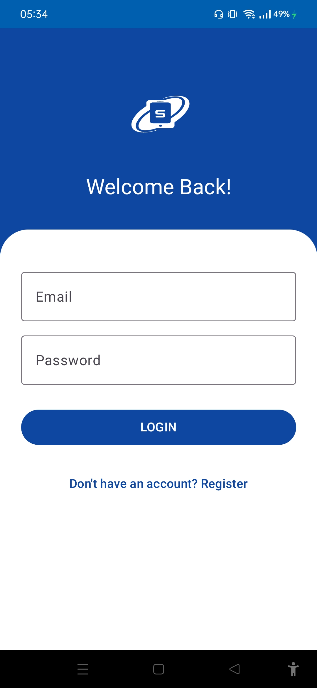
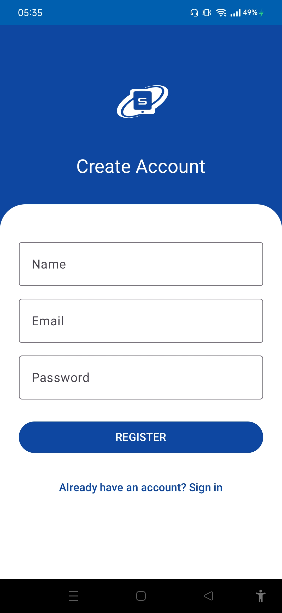
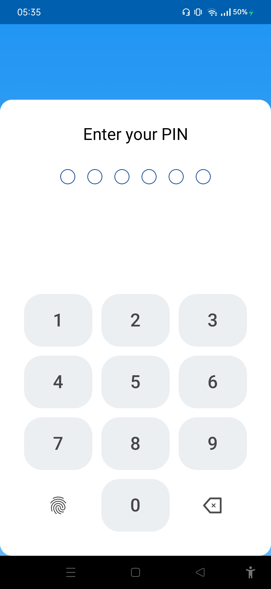
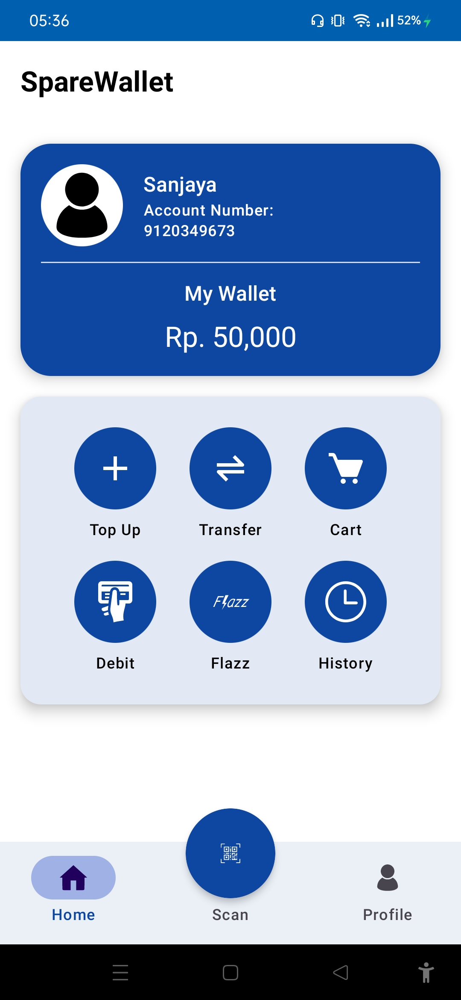
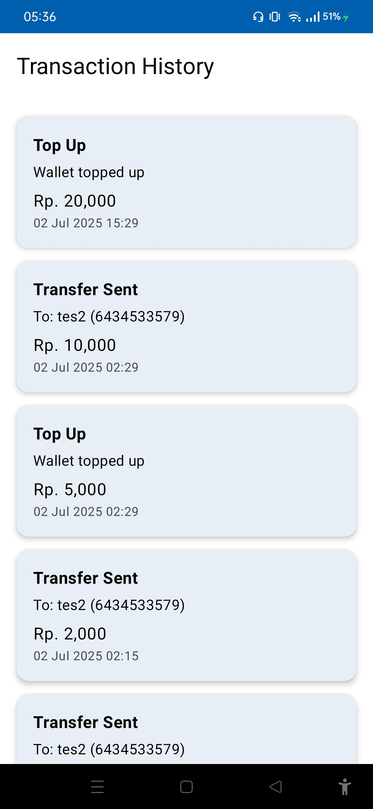

# Spare-Wallet: E-Wallet Simulation App

Spare-Wallet is an Android application designed to simulate a real-world E-Wallet. It provides essential features for managing digital funds, including secure user authentication, balance tracking, peer-to-peer transfers, and transaction history. The app is built with a modern tech stack, incorporating the latest Android development practices and a clean, user-friendly interface based on Material Design 3.

-----

## Showcase


**Key Features Screenshots**
| Login Screen | Register Screen | Enter Pin Screen | Home Screen | Transfer Screen | History Screen |
| :---: | :---: | :---: | :---: | :---: | :---: |
||||||

-----

## Key Features

  - **Secure User Authentication**: Employs Firebase Authentication for robust and secure user login and registration processes. New users can easily create an account, while existing users can log in with their credentials.
  - **Biometric and PIN Protection**: Enhances security with an initial PIN setup and subsequent biometric authentication for quick and secure access.
  - **Real-Time Balance Management**: The home screen displays the user's current balance, which is updated in real-time through Firebase Realtime Database.
  - **Effortless Fund Transfers**: Users can transfer funds to other users by entering their account number. The app includes a feature to find and verify recipients before completing a transaction.
  - **Convenient Top-Up Functionality**: Easily add funds to your wallet through a dedicated top-up screen.
  - **Comprehensive Transaction History**: A detailed history of all transactions, including top-ups, transfers sent, and transfers received, is available for review.
  - **Modern and Intuitive UI**: The user interface is built with Jetpack Compose and follows Material Design 3 guidelines, ensuring a visually appealing and easy-to-navigate experience.

-----

## 🛠Technical Stack

  - **Kotlin**: The primary programming language for the application.
  - **Jetpack Compose**: Used for building the entire user interface, providing a modern and declarative approach to UI development.
  - **Firebase**:
      - **Authentication**: Manages user sign-up and login.
      - **Realtime Database**: Stores user data, including balances and transaction records, with real-time synchronization.
  - **Material Design 3**: The application's design is based on the latest Material Design guidelines, utilizing components like `OutlinedTextField`, `Button`, `ElevatedCard`, and `NavigationBar`.
  - **ViewModel**: Manages UI-related data in a lifecycle-conscious way.
  - **Coroutines**: Used for managing asynchronous operations, ensuring the app remains responsive.

-----

## Getting Started

To get a local copy up and running, follow these simple steps.

### Prerequisites

  - Android Studio Flamingo or later
  - A Firebase project

### Installation

1.  Clone the repository:
    ```sh
    git clone https://github.com/SanjayaCF/spare-wallet.git
    ```
2.  Open the project in Android Studio.
3.  Set up a Firebase project and add the `google-services.json` file to the `app` directory.
4.  Build and run the application on an emulator or a physical device.

-----

## Project Structure

The project is organized into several packages, each responsible for a specific feature:

  - **`auth`**: Contains all activities and composables related to user authentication.
  - **`common`**: Includes shared components like the splash screen.
  - **`history`**: Manages the display of the transaction history.
  - **`main`**: Contains the main activity and the different screens accessible from the bottom navigation bar.
  - **`model`**: Defines the data models used throughout the application.
  - **`theme`**: Defines the app's theme, including colors and typography.
  - **`transfer`**: Handles the logic and UI for transferring funds.
